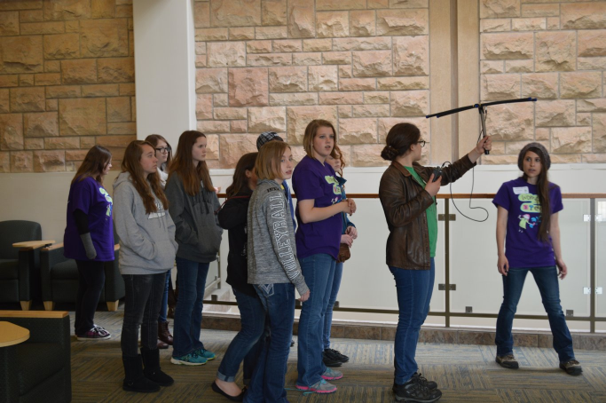
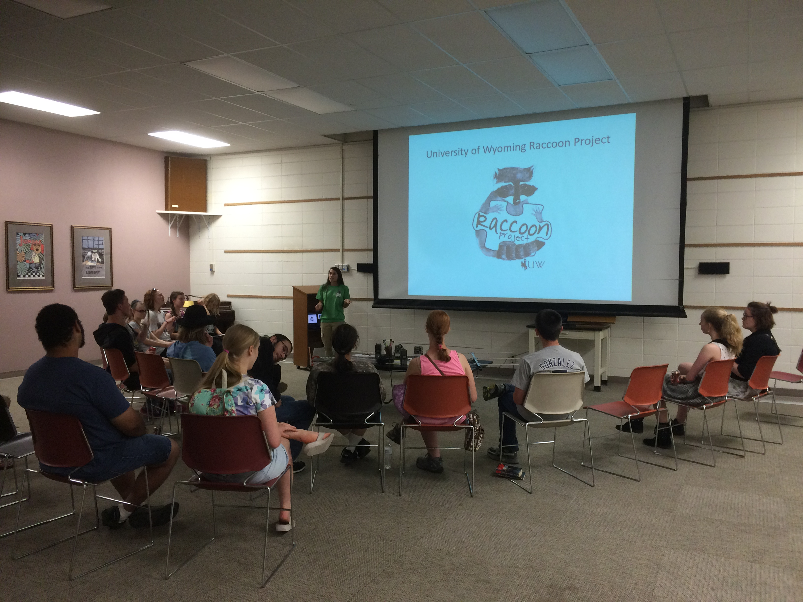

&nbsp;
  
### **OUTREACH**
#### Co-presented lesson plans on animal behavior and cognition and led hands-on activities for students in grades ranging from pre-school to high school:
- ##### Wyoming State Science Fair	(2016, 2017, 2018)
- ##### Women in STEM (2016, 2017, 2018)
- ##### Albany County Public Library (2015, 2016, 2017, 2018)
- ##### East High School, Sophomore Biology. Cheyenne, WY. (2017)
- ##### Laramie High School, AP Biology. Laramie, WY. (2017)
- ##### Beitel Elementary School. Laramie, WY. (2015)

#### Organized a booth at a local farmer's market in Laramie, WY, to engage with the public and discuss the University of Wyoming Raccoon Project's research goals:
- ##### Thursday Local Farmer's Market	(2015, 2016, 2017)

#### Public presentation on the University of Wyoming Raccoon Project (UWRP) and how to participate in UWRP community-science opportunities
- ##### Izaak Walton League- Laramie Chapter (20-April-2017)

***
|Thursday Local Farmer's Market|Radio Telemetry at UW Women in STEM Event|Raccoon presentation with a library youth group|
|:-:|:-:|:-:|
|{width=250px}|{width=270px}|{width=250px}|
***

&nbsp;
  

### **MEDIA COVERAGE**  
#### Interviews discussing the University of Wyoming Raccoon Project research:
- ##### **Right to Roam Podcast**. Episode 50: Trash Pandas and Polecats. Affectionately of Course! Aired 29-Nov-2019.
- ##### **HumaNature Podcast**. [Episode 32: Trash Bandits And Border Collies.](https://humanaturepodcast.org/podcast/episode-32-trash-bandits-and-border-collies/#more-2250) Aired 5-Dec-2019.
- ##### **Open Spaces**. [From Pests To Puzzle Solvers, Scientists Study Laramie's Raccoons.](https://www.wyomingpublicmedia.org/open-spaces/2016-09-16/from-pests-to-puzzle-solvers-scientists-study-laramies-raccoons#stream/0) Aired 16-Sep-2016 on Wyoming Public Radio. 

&nbsp;

***

<!--Add footer to webpage-->
&nbsp;

Page created by <a href="https://github.com/refanelli/">Rachel E. Fanelli</a>

<em>rachel.fanelli.ref@gmail.com</em>

<!-- Add icon library -->
<link rel="stylesheet" href="https://cdnjs.cloudflare.com/ajax/libs/font-awesome/4.7.0/css/font-awesome.min.css">

<!-- Add academicons library -->
<link rel="stylesheet"  href="https://cdn.jsdelivr.net/gh/jpswalsh/academicons@1/css/academicons.min.css">

<!-- Add font awesome icons -->

    
    
    
    
    

&nbsp;
