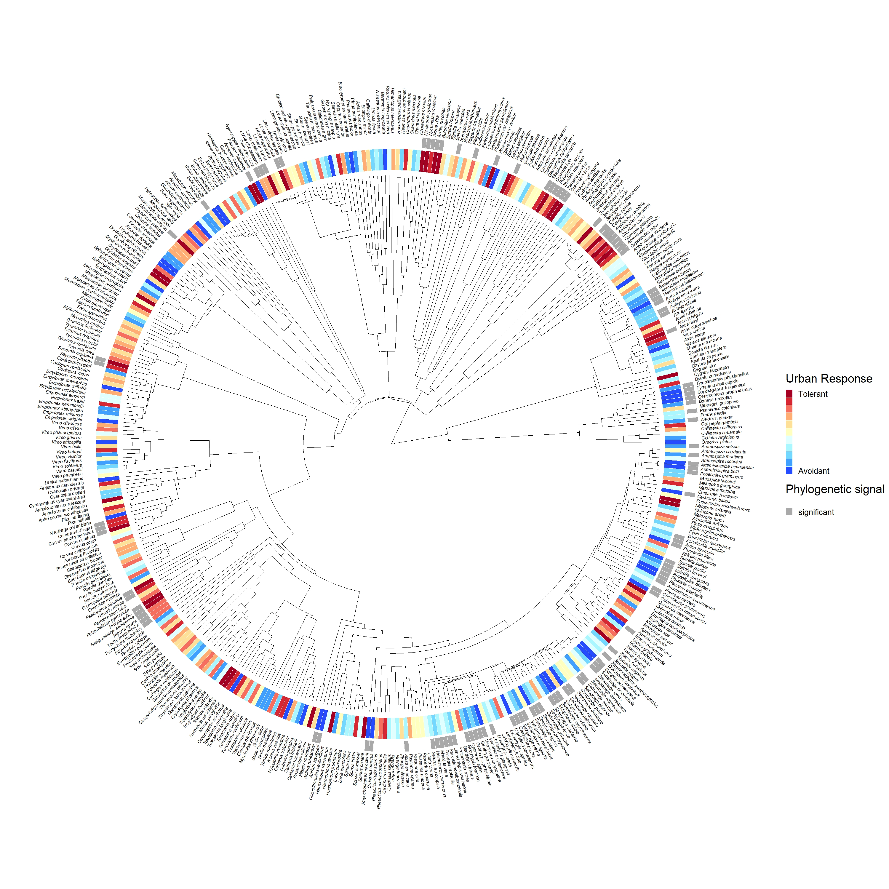

&nbsp;

### **RESEARCH INTERESTS**

#### **Environmental drivers of torpor in a facultative hibernator** (PhD Research)
Hibernation is a series of torpor bouts punctuated by interbout arousals (IBA) during which animals rewarm and increase their metabolism. Notably, the frequency, duration, and temperature of these torpor-arousal cycles vary by individual, yet the factors controlling such variation remain poorly understood, as does the precise relationship between torpor pattern and overwinter weight loss (a key predictor of survival). For my PhD research, I will test the interactive effects of hibernaculum temperature (Ta) and food availability on the torpor patterns of wild-caught least chipmunks (*Neotamias minimus*) using a full factorial experimental design in semi-natural enclosures. I hypothesize (1) that both ambient temperature and food quantity/quality will affect torpor pattern, and (2) that torpor pattern will affect overwinter weight loss. 

&nbsp;

#### **The effects of torpor on memory and learning** 
Least chipmunks are scatter-hoarders that rely on spatial memory to retrieve food cached on the landscape, so the ability to form and recall memories post-hibernation is likely important for survival. To understand how torpor influences the brain at the molecular and structural level, we need a brain atlas. I am currently working with Drs Eric Quallen, Merav Ben-David, and Nicole Bedford to build a brain atlas for the least chipmunk. 

{width=1000px}

#### **Avian biodiversity in urban habitats** (MSc research)
##### I used novel methods to quantify species-level tolerance to urban habitat in North American birds using eBird Status and Trends data and geospatial urban landscape datasets. These methods allowed me to develop a continuous estimate that captures species' tolerance to urban habitat across their breeding ranges in the United States and Canada for 432 species. 

{width=900px}

###### Distribution of urban tolerance scores for 432 North American bird species spanning 19 orders and 60 families. The continuous urban tolerance estimate distinguished species known for their urban-tolerance or urban-avoidance quite well. Bar colors denote focal test species: urban (red, n=12), nonurban (blue, n=12), and all other species (grey, n=408). Test species were selected based on summaries available on the Birds of the World Database. The dashed line denotes the mean urban tolerance estimate.  

&nbsp;

#### **Phylogenetic signal for urban tolerance**
##### I also assessed the relative contribution of phylogeny on the continuous urban tolerance estimate and detected a phylogenetic signal that was distributed across the phylogeny and across the full range of urban tolerance estimates.

###### Phylogenetic tree of 432 species with urban tolerance estimates. High values indicate a greater tolerance of urban habitats (red), and low values indicate avoidance of urban habitats (blue). The continuous urban tolerance estimate is illustrated across 11 levels to facilitate visualization. The presence of a grey bar indicates species that contributed to the phylogenetic signal that was detected. (click on image to enlarge)

&nbsp;

***

<!--Add footer to webpage-->
&nbsp;

Page created by <a href="https://github.com/refanelli/">Rachel E. Fanelli</a>

<em>rachel.fanelli.ref@gmail.com</em>

<!-- Add icon library -->
<link rel="stylesheet" href="https://cdnjs.cloudflare.com/ajax/libs/font-awesome/4.7.0/css/font-awesome.min.css">

<!-- Add academicons library -->
<link rel="stylesheet"  href="https://cdn.jsdelivr.net/gh/jpswalsh/academicons@1/css/academicons.min.css">

<!-- Add font awesome icons -->

    
    
    
    
    

&nbsp;